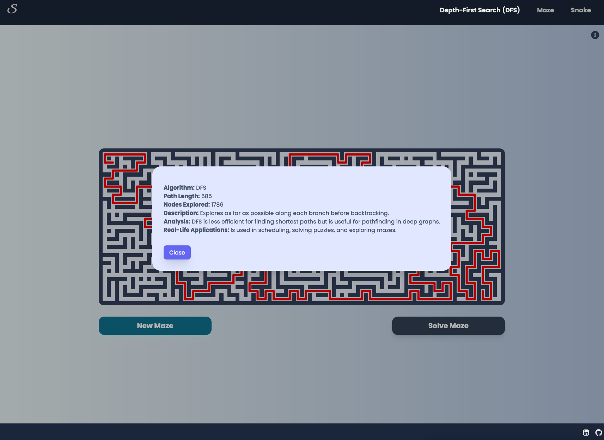

# Snaze


## Table of Contents
- [Introduction](#introduction)
- [Features](#features)
- [Technologies Used](#technologies-used)
- [Installation](#installation)
- [Usage](#usage)
- [Maze Generation and Solving](#maze-generation-and-solving)
- [Algorithms](#algorithms)
- [Snake Game](#snake-game)


## Introduction

This React-based web application is an interactive platform for visualizing maze generation and solving algorithms, as well as featuring an AI snake game. It serves as both an educational tool and a demonstration of various pathfinding techniques.


## Features

- Automatic maze generation using Recursive Backtracking algorithm
- Multiple maze-solving algorithms:
  - Breadth-First Search (BFS)
  - Depth-First Search (DFS)
  - A* Search
  - Dijkstra's Algorithm
- Interactive visualization of algorithm execution
- User-selectable start and end points
- AI-powered snake game with performance enhancements


## Technologies Used

- React
- Node
- CSS

## Installation

1. Clone the repository:
   ```
   git clone https://github.com/OldManny/Snaze.git
   ```
3. Install dependencies:
   ```
   npm install
   ```
4. Start the development server:
   ```
   npm run dev
   ```

## Usage

- [Website](https://snaze.vercel.app/)


## Maze Generation and Solving

1. **Maze Generation:** Click "New Maze" to create a random maze using the Recursive Backtracking algorithm.
2. **Start and End Points:** Click on the maze grid to set the start point (first click) and end point (second click).
3. **Algorithm Selection:** Choose from BFS, DFS, Dijkstra or A* algorithms.
4. **Solve:** Click "Solve Maze" to visualize the selected algorithm finding a path from start to end.

## Algorithms

### Maze Generation
- **Recursive Backtracking**: Creates random mazes by carving paths and backtracking when no valid moves are available.

### Maze Solving
1. **Breadth-First Search (BFS)**: Explores all neighbor nodes at the present depth before moving to nodes at the next depth level.
2. **Depth-First Search (DFS)**: Explores as far as possible along each branch before backtracking.
3. **A* Search**: Uses heuristics to find the most promising path, balancing the cost of the path so far and the estimated cost to the goal.
4. **Dijkstra's Algorithm**: Finds the shortest path between nodes in a graph, which translates well to maze solving.

Each algorithm's execution is visualized step-by-step, allowing users to understand the process. Useful informations are provided in a modal, upon maze completion.



## Snake Game

The application includes a fully autonomous, AI snake game that uses a combination of advanced techniques to navigate efficiently:

- **A★ Pathfinding Algorithm**: Determines the shortest and safest path to the food.
- **Grid System**: Enables precise movement and collision detection.
- **Heuristic Function**: Estimates the cost of reaching the food, aiding in optimal path selection.
- **Flood Fill Algorithm**: Assesses available space to avoid collisions with the snake's body.
- **Optimized Move Selection**: Utilizes techniques like lookahead, escape moves, and backtracking for best possible moves.


This implementation showcases how pathfinding algorithms can be applied to create intelligent game behavior.
